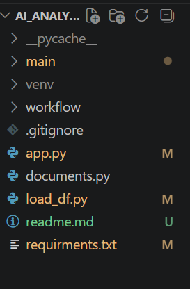
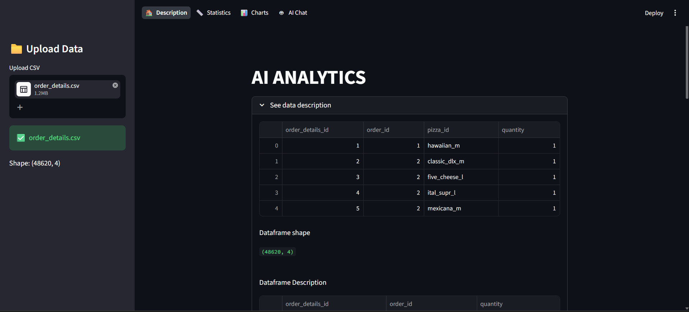
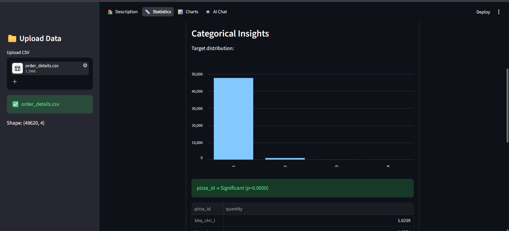
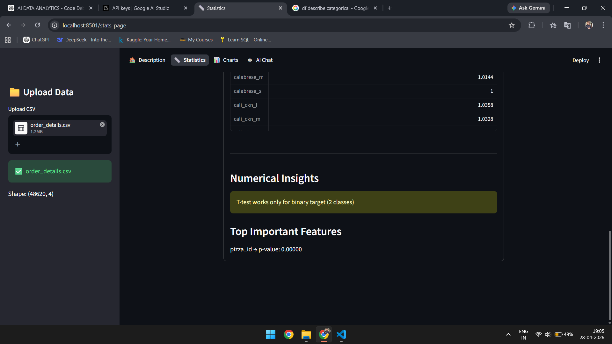
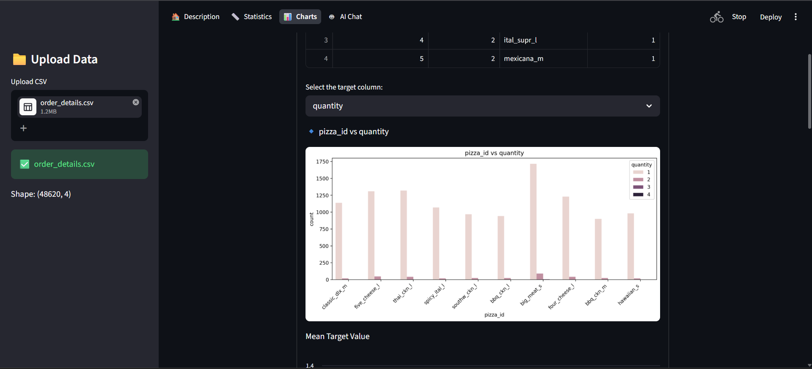
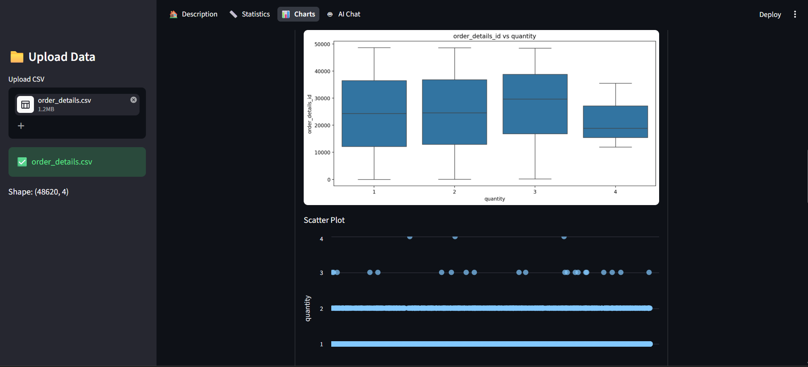
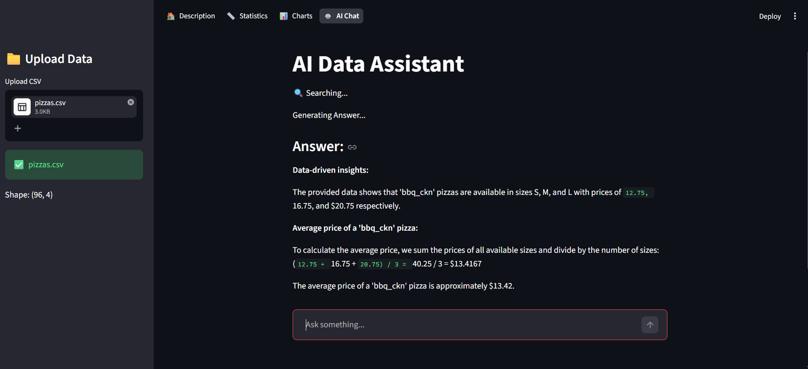
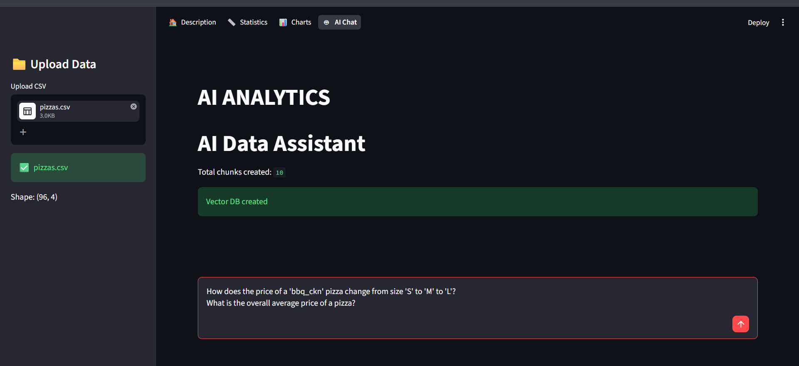
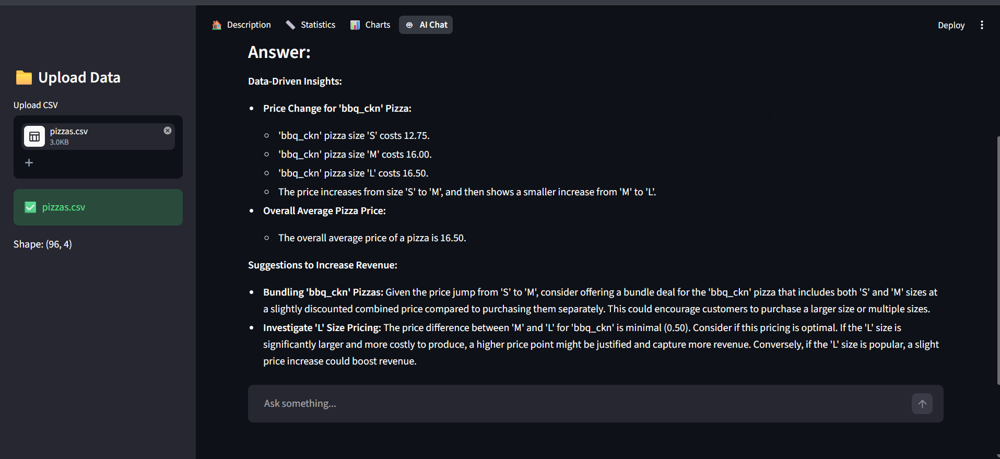
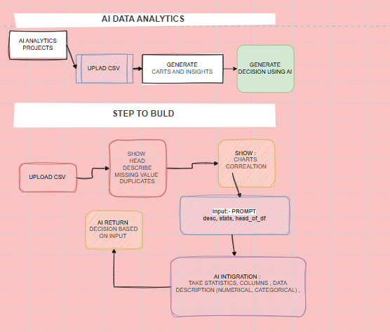

**AI ANALYTICS**
===

THIS PROJECT IS BUILD TO SOLVE THE MANUAL DATA ANALYTICS WORKS 

IN THIS PROJECT USER CAN UPLOAD THE CSV FILE AND OBSERVE THE DESCRIPTIONS ON DATA , STATISTICS OF THE DATA AND  CHARTS ALSO.

## Features

- Upload CSV dataset  
- Automatic data description  
- Statistical insights (p-value based)  
- Interactive charts  
- AI-powered analysis using Gemini  

## AI Capabilities

- Converts data into insights  
- Generates business decisions  
- RAG-based chatbot for data queries  

#### USED TECH 
- numpy
- pandas 
- matplotlib 
- seaborn
- streamlit 
- langchain
- google LLM - google_genai:gemini-2.5-flash-lite

#### FILE STRUCTURE 

#### FEATURES OF PROJECTS 

#### WORKING FLOW 

#### INSTALLATION 
    git clone (paste hare my repo link)
    cd AI_ANALYTICS
    pip install -r requirments.txt

#### run app
    streamlit run app.py

*AUTHOR* - Dhiraj sharma